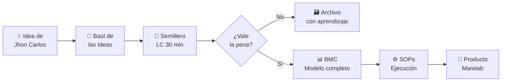

# 🏭 Marelab — Portafolio de Productos

[[HOME]] | [[Marelab - Visión y Misión]] | [[Baúl de las Ideas]]

> *Marelab no es un producto. Marelab es una empresa que crea productos.*
> *Cada producto nace en el [[Baúl de las Ideas]] y pasa por el [[Semillero de Innovación]].*

---

## Marelab como Estudio de Innovación

```
┌─────────────────────────────────────────────────────────┐
│                       MARELAB                           │
│         Estudio de Innovación Robótica — Colombia       │
│                                                         │
│   Superpoder: Creatividad (Jhon Carlos Corzo Vega)      │
│                                                         │
│  ┌─────────────────────┐   ┌─────────────────────────┐  │
│  │   🤖 RSMV           │   │  🌸 DESFILE DE ROBOTS   │  │
│  │   Robot Soccer      │   │     SILLETEROS          │  │
│  │   Mare Virtual      │   │                         │  │
│  │                     │   │                         │  │
│  │   Digital           │   │   Físico                │  │
│  │   SaaS/Freemium     │   │   Evento/Patrocinios    │  │
│  │   ✅ MVP activo     │   │   🔄 En semillero       │  │
│  └─────────────────────┘   └─────────────────────────┘  │
│                                                         │
│            🧺 Baúl → 🌱 Semillero → 📊 Modelo          │
└─────────────────────────────────────────────────────────┘
```

---

## Producto 1 — RSMV (Robot Soccer Mare Virtual)

**Estado:** ✅ MVP activo
**Tipo:** Plataforma digital (web app)
**Modelo:** SaaS / freemium con Marecoin

| Item | Detalle |
|------|---------|
| Qué es | Football Manager de robots con IA |
| Para quién | Colombianos 18-35, fans de tech+fútbol |
| Cómo gana | Marecoin + licencias + inscripciones |
| Stack | Node.js + Supabase + Vercel + Railway |
| Motor | Propio — 18/18 tests ✅ |
| Premios | Hasta $4,000,000 COP (Nacional) |

**Documentación completa:**
- [[RSMV - Qué Es]]
- [[LC - RSMV v1]] ✅ validado
- [[BMC Marelab]]

---

## Producto 2 — Desfile de Robots Silleteros

**Estado:** 🔄 En semillero (validando instituciones)
**Tipo:** Evento presencial anual
**Modelo:** Patrocinios + inscripciones + Alcaldía

| Item | Detalle |
|------|---------|
| Qué es | Competencia de robots cargando silletas |
| Para quién | Colegios/universidades + Feria de las Flores |
| Cómo gana | Patrocinios + inscripciones + apoyo institucional |
| Stack | Hardware (robots físicos) + software de evaluación |
| Conexión cultural | Feria de las Flores de Medellín |
| Validación pendiente | Alcaldía + Festival de las Flores |

**Documentación:**
- [[LC - Desfile de Robots v1]] 🔄 en evaluación

---

## ADN Compartido de los Productos

Ambos productos comparten el mismo ADN Marelab:

| ADN | RSMV | Desfile de Robots |
|-----|------|------------------|
| 🤖 Robótica | Robots virtuales | Robots físicos |
| 🇨🇴 Colombia | Torneos por ciudades | Feria de las Flores |
| 🏆 Competencia | Torneos con premios | Evento anual con premiación |
| 💡 Creatividad | Motor de simulación propio | Concepto cultural único |
| 📱 Comunidad | 1,024 jugadores online | Colegios + audiencia presencial |

---

## Pipeline del Portafolio

```
ACTIVO          EN SEMILLERO         BAÚL (ideas)
  │                   │                   │
RSMV            Desfile de           (próxima idea
  │             Robots               de Jhon Carlos)
  ▼                   │
Torneos reales        ▼
(Q2 2026)       Piloto con
                1 colegio
                (Q3 2026?)
```

---

## Cómo Nace un Nuevo Producto en Marelab



---

## Valores de Marelab como Empresa

1. **Colombia primero** — los productos nacen de la cultura colombiana
2. **Tecnología accesible** — robótica para todos, no solo para ricos
3. **Creatividad como motor** — el superpoder del fundador
4. **Sistemas sobre improvisación** — el Cerebro Digital es prueba de eso
5. **Transparencia** — seed fijo en RSMV, conceptos abiertos, código documentado

---

## Relacionado
- [[Marelab - Visión y Misión]]
- [[Marelab - Fundador]]
- [[Baúl de las Ideas]]
- [[Semillero de Innovación]]
- [[Índice de Modelos]]
