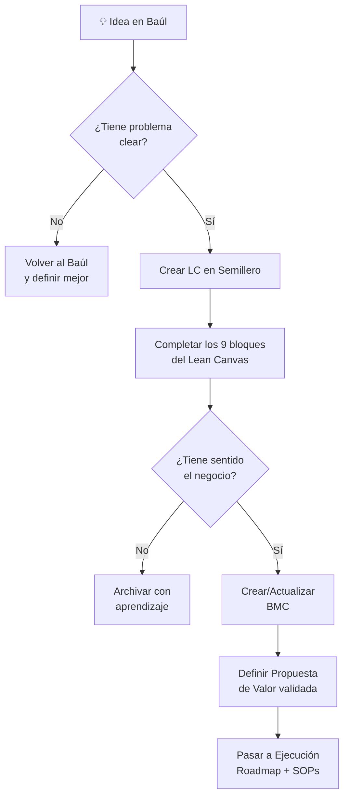

# 🌱 Semillero de Innovación — Marelab

[[Baúl de las Ideas]] → **aquí** → [[BMC Marelab]] | [[Protocolo del Sistema]]

> *El lugar donde las ideas dejan de ser brutos y se convierten en hipótesis de negocio.*

---

## Propósito del Semillero

El **Baúl** atrapa ideas sin filtro.
El **Semillero** les hace las preguntas difíciles:

- ¿Hay alguien con este problema?
- ¿Nuestra solución es mejor que lo que existe?
- ¿Podemos ganar dinero con esto?
- ¿Vale la pena seguir?

Si la idea sobrevive estas preguntas → pasa al [[BMC Marelab]].
Si no → se archiva con aprendizaje.

---

## Herramienta del Semillero: Lean Canvas

El **Lean Canvas (LC)** es la herramienta del semillero porque:
- Se completa en 20–30 minutos
- Fuerza a pensar en el problema ANTES que la solución
- Es fácil de iterar (no es un plan de negocio de 40 páginas)
- Muestra las hipótesis más riesgosas desde el inicio

Plantilla: [[Lean Canvas (Plantilla)]]

---

## Lean Canvas vs. BMC — Cuándo Usar Cada Uno

| | Lean Canvas | Business Model Canvas |
|--|-------------|----------------------|
| Etapa | Idea temprana | Modelo validado |
| Foco | Problema + Solución | Modelo completo |
| Tiempo | 20–30 min | 2–4 horas |
| Iteraciones | Muchas y rápidas | Pocas y profundas |
| Para quién | Emprendedor en exploración | Equipo operando |

**Regla práctica:**
> LC primero. BMC cuando el LC ya no cambia tanto.

---

## Ideas Actuales en el Semillero

### En Evaluación
| Idea | LC | Estado |
|------|----|--------|
| [[LC - RSMV v1]] | Completo | ✅ Pasó a BMC |

### Descartadas (con aprendizaje)
*(vacío por ahora)*

### Cola de Evaluación
*(ideas del Baúl que esperan LC)*

---

## El Proceso: Paso a Paso

---

## Conectado con
- [[Baúl de las Ideas]] — de donde vienen las ideas
- [[Lean Canvas (Plantilla)]] — herramienta del semillero
- [[LC - RSMV v1]] — el LC de RSMV
- [[BMC Marelab]] — a donde pasan las ideas aprobadas
- [[Protocolo del Sistema]] — el sistema completo
