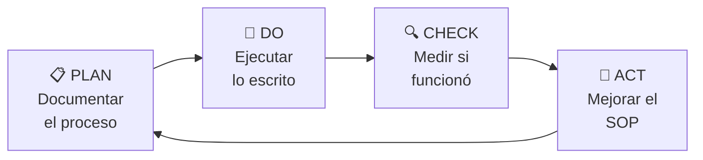

# ⚙️ Mejora de Procesos — Guía Marelab

[[HOME]] | [[Protocolo del Sistema]]

---

## Por Qué Documentar Procesos

> Un proceso que no está escrito depende de la memoria de una persona.
> Una persona no es un sistema.

En Marelab, documentar procesos permite:
- Ejecutar torneos sin improvisar
- Incorporar nuevas personas sin fricción
- Identificar dónde se rompe algo cuando falla
- Mejorar de forma sistemática, no intuitiva

---

## La Herramienta Recomendada: SOP + Mermaid

### Por qué SOP (Standard Operating Procedure)
- Formato simple: título, propósito, pasos numerados, resultado esperado
- Una nota = un proceso
- Fácil de actualizar cuando el proceso cambia
- Sin curva de aprendizaje

### Por qué Mermaid (no Lucidchart, no Miro)
- Nativo en Obsidian — no necesitas salir de la app
- El diagrama vive en la misma nota que el SOP
- Se versiona con git (es texto, no imagen)
- Suficientemente potente para lo que necesitamos

> Para procesos muy complejos o que involucran múltiples equipos,
> considera **Notion** (más visual) o **Miro** (colaborativo).
> Pero para el 90% de lo que hace Marelab ahora, SOP + Mermaid es suficiente.

---

## Tipos de Notas de Proceso

| Tipo | Cuándo usarlo | Ejemplo |
|------|---------------|---------|
| **SOP** | Proceso repetible paso a paso | `SOP - Ejecutar Torneo` |
| **Checklist** | Verificación antes de un evento | `Checklist - Deploy Producción` |
| **Flujo de decisión** | Proceso con muchas bifurcaciones | `Flujo - Resolución de Reclamos` |
| **Retrospectiva** | Después de un evento importante | `Retro - Torneo Municipal Abr 2026` |

---

## Estructura de un SOP

```markdown
# SOP — [Nombre del Proceso]

**Responsable:** [quién lo ejecuta]
**Frecuencia:** [cuándo se ejecuta]
**Tiempo estimado:** [cuánto tarda]
**Input:** [qué necesitas para empezar]
**Output:** [qué produces al terminar]

---

## Diagrama

[diagrama Mermaid aquí]

---

## Pasos

1. [paso 1]
2. [paso 2]
...

## Criterio de Éxito

¿Cómo sabes que el proceso funcionó correctamente?

## Si Algo Falla

¿Qué haces si el paso X falla?
```

---

## El Ciclo de Mejora: PDCA

Cada proceso documentado debe pasar por este ciclo:



**PLAN:** Escribe el SOP antes de ejecutar.
**DO:** Ejecuta exactamente lo que escribiste.
**CHECK:** ¿El proceso produjo el resultado esperado?
**ACT:** Si no → actualiza el SOP. Si sí → mantén o simplifica.

---

## Procesos Prioritarios de Documentar (Arelab)

| Proceso | Prioridad | SOP |
|---------|-----------|-----|
| Ejecutar torneo completo | ALTA | [[SOP - Ejecutar Torneo]] |
| Onboarding de nuevo usuario | ALTA | [[SOP - Onboarding Usuario]] |
| Pago de premios a ganadores | ALTA | [[SOP - Pagar Premio]] |
| Deploy a producción | MEDIA | [[SOP - Deploy Producción]] |
| Responder reclamo de jugador | MEDIA | *(pendiente)* |
| Crear nueva academia | BAJA | *(pendiente)* |

---

## Señales de que un Proceso Necesita SOP

- [ ] Lo ejecutaste dos veces y cada vez fue diferente
- [ ] Alguien te preguntó "¿cómo se hace esto?"
- [ ] Algo salió mal y no sabes exactamente en qué paso
- [ ] Tienes miedo de que alguien más lo haga sin supervisión

---

## Relacionado
- [[SOP - Ejecutar Torneo]]
- [[SOP - Onboarding Usuario]]
- [[SOP - Pagar Premio]]
- [[Protocolo del Sistema]]
