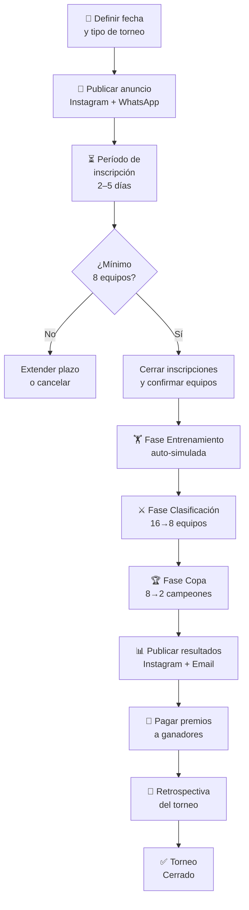

# SOP — Ejecutar Torneo RSMV

[[Mejora de Procesos — Guía]] | [[RSMV - Torneos y Premios]]

**Responsable:** Jhon Carlos Corzo Vega (fundador)
**Frecuencia:** Por ciclo de torneo (municipal / regional / nacional)
**Tiempo estimado:** 3–5 días (incluyendo espera de inscripciones)
**Input:** Fecha de inicio confirmada + mínimo 8 equipos inscritos
**Output:** Torneo finalizado, premios pagados, resultados publicados

---

## Diagrama del Proceso

---

## Pasos Detallados

### Fase 0 — Preparación (Día -7 a -3)

- [ ] Verificar que el motor de simulación está funcional (`node motor.test.js` → 18/18)
- [ ] Verificar uptime del backend (`GET /health`)
- [ ] Definir: tipo de torneo, fecha inicio, premio
- [ ] Crear registro de torneo en la base de datos (estado: `pendiente`)
- [ ] Preparar post de anuncio para Instagram

---

### Fase 1 — Anuncio y Reclutamiento (Día -3 a 0)

- [ ] Publicar en Instagram @marecolombia
- [ ] Enviar mensaje a grupos WhatsApp de jugadores
- [ ] Activar inscripciones en la plataforma (`/api/torneos/:id/inscribir`)
- [ ] Monitorear inscripciones diariamente

**Criterio de avance:** Mínimo 8 equipos inscritos (16 para torneo completo)

---

### Fase 2 — Entrenamiento (Día 0)

- [ ] Cerrar inscripciones
- [ ] Cambiar estado torneo → `en_curso`
- [ ] Ejecutar simulación de entrenamiento para todos los equipos
- [ ] Publicar resultados de penales y Super Penal
- [ ] Notificar jugadores por email (automático via Resend)

---

### Fase 3 — Clasificación (Día 1)

- [ ] Ejecutar simulación de clasificación (16 → 8)
- [ ] Resolver empates con Super Penal automático
- [ ] Publicar bracket actualizado
- [ ] Notificar clasificados y eliminados

---

### Fase 4 — Copa (Día 2)

- [ ] Ejecutar semifinales (8 → 4)
- [ ] Ejecutar finales (4 → 2 campeones)
- [ ] Registrar campeones en DB (`campeon: true`)
- [ ] Calcular EXP final de todos los participantes

---

### Fase 5 — Cierre (Día 3)

- [ ] Cambiar estado torneo → `finalizado`
- [ ] Publicar resultados completos (Instagram + email)
- [ ] Verificar datos bancarios de ganadores (WhatsApp directo)
- [ ] Ejecutar pago de premios → ver [[SOP - Pagar Premio]]
- [ ] Publicar historia del campeón en redes

---

### Fase 6 — Retrospectiva (Día 4)

- [ ] ¿Cuántos equipos se inscribieron vs. meta?
- [ ] ¿Hubo errores técnicos? ¿Cuáles?
- [ ] ¿El email llegó a tiempo?
- [ ] ¿Los jugadores quedaron satisfechos? (encuesta rápida WhatsApp)
- [ ] Actualizar este SOP si algo cambió

---

## Criterio de Éxito

- Torneo finalizado sin errores técnicos
- Premios pagados en ≤ 48h de finalizar
- Resultados publicados el mismo día de la final
- ≥ 80% de participantes recibieron email de resultados

---

## Si Algo Falla

| Problema | Acción |
|----------|--------|
| El motor crashea | Revisar logs Railway, reiniciar servicio |
| Un equipo queda incompleto (< 4 jugadores) | Completar con jugadores fantasma temporales |
| El pago no llega al ganador | Contactar directo por WhatsApp, confirmar datos |
| Pocos equipos inscritos | Extender plazo 2 días o lanzar "modo express" |

---

## Relacionado
- [[RSMV - Torneos y Premios]]
- [[RSMV - Motor de Simulación]]
- [[SOP - Pagar Premio]]
- [[Deploy e Infraestructura]]
