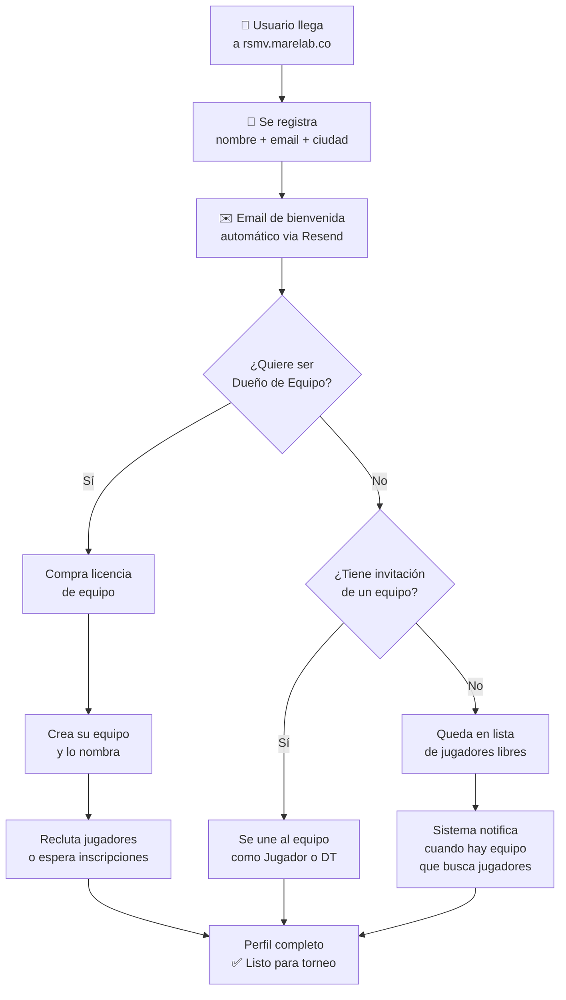

# SOP — Onboarding de Nuevo Usuario

[[Mejora de Procesos — Guía]] | [[Frontend]] | [[Backend API]]

**Responsable:** Sistema automático (plataforma) + Fundador para soporte
**Frecuencia:** Cada vez que se registra un nuevo usuario
**Tiempo estimado:** 5–10 min del usuario, automático en su mayoría
**Input:** Usuario llega a la plataforma (por cualquier canal)
**Output:** Usuario activo, con equipo asignado o creado, listo para su primer torneo

---

## Diagrama del Proceso



---

## Pasos del Sistema (Automáticos)

### Al Registrarse

- [ ] Crear cuenta en Supabase Auth (`POST /api/auth/register`)
- [ ] Crear perfil en tabla `perfiles` con `marecoin_saldo: 0`
- [ ] Crear registro en tabla `jugadores` con `exp_total: 0, nivel: local`
- [ ] Enviar email de bienvenida (Resend) con:
  - Nombre del usuario
  - Link a la plataforma
  - Cómo empezar (3 pasos)
  - Link a WhatsApp de soporte

---

### Email de Bienvenida — Contenido

**Asunto:** Bienvenido a RSMV — ¡Empieza tu carrera en el fútbol robótico!

```
Hola [nombre],

Tu cuenta en RSMV está lista. 🤖⚽

Aquí van tus primeros 3 pasos:

1. Completa tu perfil (ciudad + WhatsApp)
2. Únete a un equipo o crea el tuyo
3. Inscríbete al próximo torneo

Tienes [X] Marecoin de bienvenida para empezar.

Cualquier duda: WhatsApp 315 2445278

¡Nos vemos en la cancha!
Jhon Carlos — Marelab
```

---

## Pasos del Usuario (Manual)

### Paso 1 — Completar Perfil (5 min)

- Ciudad
- WhatsApp
- Avatar (opcional)

### Paso 2 — Elegir Rol

**Opción A: Jugador**
- Buscar equipo que necesite jugadores
- Solicitar unirse
- El dueño del equipo acepta

**Opción B: Dueño de Equipo**
- Comprar licencia de equipo
- Crear equipo (nombre único)
- Reclutar 3 jugadores más
- Contratar DT (opcional)

**Opción C: Director Técnico**
- Crear perfil de DT
- Esperar oferta de un equipo
- Aceptar o buscar activamente

### Paso 3 — Inscribirse a un Torneo

- Ver torneos disponibles en `/torneos`
- Inscribir el equipo (si es dueño) o confirmar participación (si es jugador)

---

## Marecoin de Bienvenida

| Monto sugerido | Justificación |
|----------------|---------------|
| 10–20 MC | Suficiente para ver tu propio EXP (3 MC) y activar IA-DT básica (20 MC) |

> Esto crea el primer loop de engagement: usas el MC, ves el valor, quieres más.

---

## Criterio de Éxito

- Usuario registrado y con email de bienvenida recibido
- Perfil completo (ciudad + WhatsApp)
- Asignado a un equipo o en lista de espera
- Ha visto al menos 1 torneo disponible

---

## Puntos de Fricción Conocidos

| Fricción | Solución |
|----------|----------|
| No hay equipos disponibles | Lista de espera + notificación automática |
| No entiende los roles | Tutorial de 3 pasos en el dashboard |
| No tiene MC para nada | Marecoin de bienvenida obligatorio |
| No sabe qué es un torneo | Video corto o GIF en la landing |

---

## Relacionado
- [[Frontend]] — las páginas del proceso
- [[Backend API]] — los endpoints involucrados
- [[RSMV - Marecoin]] — el saldo de bienvenida
- [[BMC-4 Relación con Clientes]] — por qué este proceso importa
