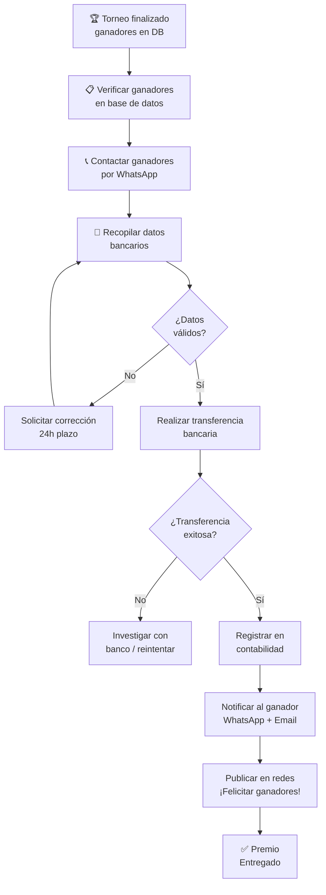

# SOP — Pagar Premio a Ganadores

[[Mejora de Procesos — Guía]] | [[RSMV - Torneos y Premios]] | [[Regulación Colombia]]

**Responsable:** Jhon Carlos Corzo Vega (fundador)
**Frecuencia:** Al finalizar cada torneo con premios reales
**Tiempo estimado:** 24–48 horas desde el fin del torneo
**Input:** Torneo finalizado + ganadores confirmados en DB
**Output:** Premios transferidos + registro contable + ganadores notificados

---

## Diagrama del Proceso



---

## Paso 1 — Verificar Ganadores (inmediato)

- [ ] Consultar tabla `torneo_equipos` donde `campeon = true`
- [ ] Confirmar `posicion_final` y `premio_ganado` de cada equipo
- [ ] Revisar que el `estado` del torneo sea `finalizado`
- [ ] Listar: ganador, equipo, premio en COP, datos de contacto del dueño

---

## Paso 2 — Contactar Ganadores (Día 0)

- [ ] Enviar WhatsApp directo al dueño del equipo ganador
- [ ] Mensaje sugerido:

```
🏆 ¡Felicidades [nombre]!

Tu equipo [nombre equipo] ganó el [tipo] torneo RSMV.

Tu premio es: $[monto] COP

Para procesarlo, necesito:
- Nombre completo (titular de cuenta)
- Banco
- Tipo de cuenta (ahorro/corriente)
- Número de cuenta
- Número de cédula

Tienes 48h para enviarme estos datos.

¡Gracias por competir! 🤖⚽
Jhon Carlos — Marelab
```

---

## Paso 3 — Recopilar Datos Bancarios

- [ ] Nombre completo del titular
- [ ] Banco (Bancolombia, Nequi, Daviplata, etc.)
- [ ] Tipo de cuenta (ahorro / corriente / Nequi / Daviplata)
- [ ] Número de cuenta
- [ ] Número de cédula (para Nequi/Daviplata: el número del celular)

> ⚠️ Guardar estos datos de forma segura. No compartir con terceros.

---

## Paso 4 — Realizar la Transferencia

- [ ] Verificar saldo disponible en la cuenta Marelab
- [ ] Realizar transferencia desde app bancaria o portal web
- [ ] Guardar comprobante de la transacción (screenshot o PDF)

**Canales de pago recomendados (Colombia):**
- Nequi / Daviplata (instantáneo, sin costo)
- PSE Bancolombia (mismo día)
- Transferencia interbancaria (1 día hábil)

---

## Paso 5 — Registro Contable

- [ ] Registrar en hoja de control:
  - Fecha
  - Torneo
  - Ganador (equipo + dueño)
  - Monto COP
  - Número de comprobante
- [ ] Actualizar campo `premio_ganado` en tabla `torneo_equipos` si no está registrado

---

## Paso 6 — Notificación y Cierre Público

- [ ] Enviar WhatsApp de confirmación al ganador con el comprobante
- [ ] Publicar historia en Instagram con el campeón (con su permiso)
- [ ] Email automático de confirmación de pago

---

## Tabla de Premios de Referencia

| Torneo | Posición | Premio |
|--------|----------|--------|
| Municipal | Campeón | $100,000 COP |
| Regional | Campeón | $400,000 COP |
| Nacional | 1° | $4,000,000 COP |
| Nacional | 2° | $2,500,000 COP |

---

## Consideraciones Legales

> ⚠️ Ver [[Regulación Colombia]] antes de activar pagos reales.

- Premios > $1,000,000 COP pueden requerir retención en la fuente
- Documentar todos los pagos para declaración de renta
- Los datos bancarios de los ganadores deben tratarse como datos personales (Ley 1581)

---

## Si Algo Falla

| Problema | Acción |
|----------|--------|
| Ganador no responde en 48h | Recontactar. Si 72h: publicar en grupo WhatsApp |
| Datos bancarios incorrectos | Solicitar corrección y reintentar |
| Sin fondos para pagar | CRÍTICO — escalar inmediatamente, usar reserva |
| Banco rechaza transferencia | Probar con Nequi / Daviplata como alternativa |

---

## Relacionado
- [[SOP - Ejecutar Torneo]]
- [[RSMV - Torneos y Premios]]
- [[BMC-9 Estructura de Costos]]
- [[Regulación Colombia]]
